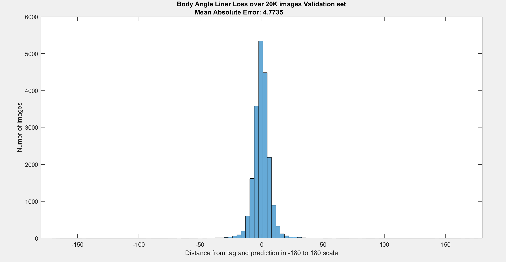
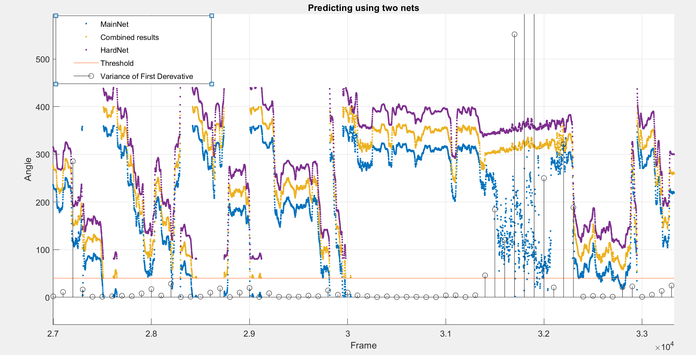
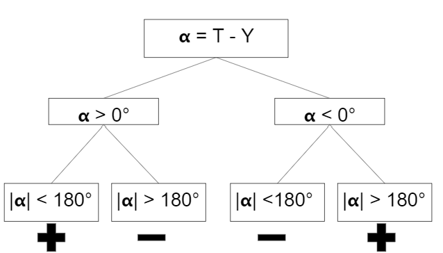

# Extracting the body & head angle of a rat out of a video frame using CNN

This project goal was to automatically extract the head and body angles of a rat in an arena, out of a video frame, using CNN. 
I used two net architectures: first, resNet, custom written, second, my own custom basic model of ANN with an Convolution unit.
Due to the fact that the nets output is cyclic (an angle between 0 to 359), I had to write a new regression layer and a corresponding loss function.
I will only include here the main code files in order to presentes the main ideas in the project. The project was written in Matlab due to the lab requirement.

Above is an input image with the arrows based on the outputs - head and body angles. A brain monitoring device is attached to the rats head, what makes the recognition task less trivial.

This graph shows the difference between predictions over tags of a validation set.

## Folders

Train_net: This folder contains the functions for training nets and validating them.

Data_preparetion: Contains a function for augmentation of the data.

Tagger: Tagging the data was necessary. I built a GUI for tagging data.

Resulets: contains the validations of the network and video results on raw data.

Predicte: predicting using two networks. More information below.

## Using two nets for Minimizing prediction running time 

Minimizing the running time of the prediction of the net had great importance to the project. Therefore I dropped the input image size from 200X200 pixels to 100X100 and afterwards to 50X50. While net performance on most of the 50X50 images were good, for a few images of a certain behavior of the rat, the 50X50 resolution was too low causing bad results. I implemented a function that can detect those parts where the 50X50 net fails (based on the variance of the first derivative of the net output), and used a 100X100 net only for predicting those “hard” parts.
This manipulation improved the prediction running time and accuracy. 

The next graph shows the prediction of the networks over frames out a video. In blue are the predictions of the MainNet(faster net with 50X50 input), in purple the predictions of the HardNet(slower net with 100x100 input) and in yellow their combination. The HardNet and the combination values were added 80 and 40 respectively for each prediction in order to separate between the graphs. The graph also includes the variance of the first derivative over 100 frames of the MainNet and a threshold for this parameter. This parameter indicates on frames where the MainNet performs badly on, parts where the predictions are not continuous, like in frames 3.15 to 3.25. One can notice that the HardNet performs well on those parts, and therefore the use of both give better results. Important to mention that during inference time HardNet is predicting only those hard parts and not all frames.

## Cyclic regrassion layer 

Because of the cyclic output and due to the fact there were not any built in loss function for this output, I implement a squared loss function and its derivative for the regression layer. Deriving the squared distance between tags (T) and predictions (Y) required the subtraction function
Y - T. Due to cyclicality it is not trivial and the sign of this function is case dependent.

This tree shows the sepration into cases.

-------------------------------------------------------------------------------------------------------------

